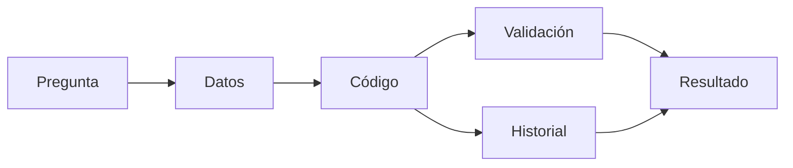
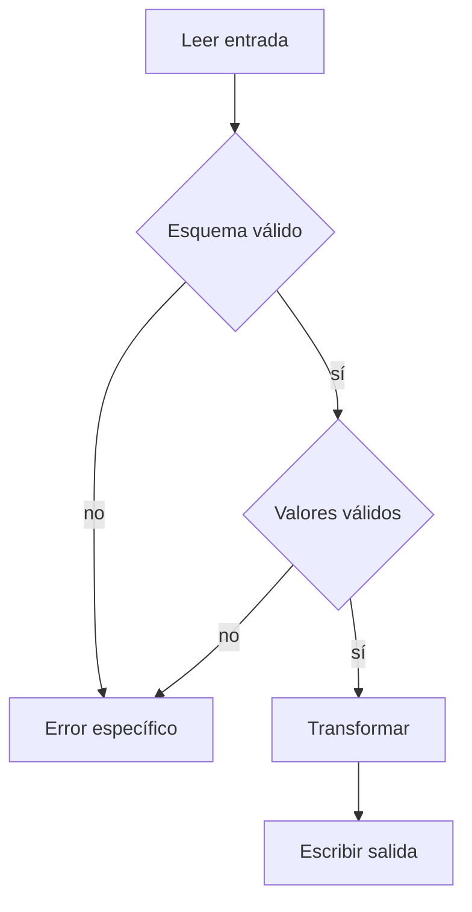

## Pregunta de la sesión

> ¿Qué evidencia convierte un script que “funciona” en un proceso científico defendible?

::: notes
Abrir con dos respuestas breves del grupo. No definir todavía código limpio.
:::

## Objetivos

Al finalizar, podrás:

- distinguir ejecución de confiabilidad científica;
- formular el contrato de un script;
- priorizar riesgos de legibilidad, validación y portabilidad;
- vincular una mejora con una comprobación observable.

## Ruta de 120 minutos

| Minutos | Trabajo |
|---:|---|
| 0–15 | Diagnóstico y propósito |
| 15–40 | Contrato, estructura y nombres |
| 40–65 | Validación, errores y evidencia |
| 65–80 | Demostración reproducible |
| 80–105 | Actividad en equipos |
| 105–120 | Evaluación y cierre |

## El resultado no basta

Dos scripts pueden producir la misma cifra hoy y ofrecer garantías muy distintas para mañana.

- ¿Se conoce la entrada?
- ¿Se verificaron sus supuestos?
- ¿Puede repetirse el comando?
- ¿Queda una salida interpretable?

## El código forma parte de la evidencia



## Un contrato antes del refactor

Un contrato mínimo declara:

1. entrada;
2. precondiciones;
3. transformación;
4. salida;
5. fallos esperados.

::: notes
Pedir un ejemplo cotidiano: una función que recibe temperatura. Destacar unidades y valores admisibles.
:::

## Caso: desembarques sintéticos

La tarea es resumir toneladas por especie sin alterar la fuente.

La fila negativa marcada `invalid` es deliberada: permite observar si el script aplica su contrato.

## Leer un script frágil

```python
import pandas as pd
d = pd.read_csv("Desktop/desembarques.csv")
d = d[d.quality_flag != "invalid"]
d["landings_t"] = d["landings_t"].fillna(0)
x = d.groupby("species")["landings_t"].sum()
x.to_csv("Desktop/final.csv")
print("listo")
```

## ¿Qué puede salir mal en silencio?

- una columna cambia de nombre;
- una fecha no es válida;
- un identificador se duplica;
- un faltante se convierte en cero;
- una salida anterior se sobrescribe.

## Nombres que transportan intención

`records` comunica más que `d`.

`summarize_by_species()` comunica más que `process()`.

El nombre debe expresar el dominio o la responsabilidad, no repetir el tipo técnico.

## Funciones proporcionales

Separar cuando existe una responsabilidad comprobable:

```text
read → validate → filter → summarize → write
```

Más archivos y más capas no son automáticamente mejor diseño.

## Configuración sin ceremonia

Para un script pequeño, argumentos de línea de comandos pueden bastar.

```powershell
python scripts/python/part-iv/summarize_landings.py `
  data/example/part-iv/synthetic-landings.csv `
  output/species-summary.csv
```

## Fallar temprano



## Un error también es una salida

Un mensaje útil indica:

- qué condición falló;
- dónde ocurrió;
- qué esperaba el programa;
- cómo puede investigarse.

No debe exponer rutas personales, credenciales ni datos sensibles.

## Evidencia proporcional

Para este caso basta conservar:

- comando;
- versión del código;
- metadatos del conjunto;
- salida;
- estado de validación.

## Demostración

1. Ejecutar el script Python con el CSV sintético.
2. Inspeccionar el resumen.
3. Retirar una columna en una copia temporal.
4. Repetir y leer el fallo.

::: notes
No editar data/example. Crear cualquier caso inválido fuera de la fuente y eliminarlo al terminar.
:::

## Antes y después

| Antes | Después |
|---|---|
| ruta asumida | entrada explícita |
| nombres ambiguos | vocabulario del dominio |
| corrección silenciosa | validación explícita |
| `listo` | estado y recuentos |
| `final.csv` | salida elegida por quien ejecuta |

## Actividad individual · 12 min

Sin ejecutar el script, identifica cinco prácticas frágiles y clasifícalas como riesgo de entrada, transformación, salida o trazabilidad.

## Discusión crítica · 13 min

En equipos, comparen sus diagnósticos y elijan tres riesgos prioritarios. Para cada uno:

1. Escriba su contrato.
2. Priorice tres riesgos.
3. Proponga el cambio mínimo para cada riesgo.
4. Defina una prueba de éxito y una de fallo.
5. Prepare una justificación de 90 segundos.

## Restricción de diseño

No se puntúa la cantidad de funciones ni de archivos.

Se puntúa la relación entre riesgo, decisión y evidencia.

## Puesta en común

Use esta fórmula:

> Detectamos ___; puede causar ___; proponemos ___; lo comprobaríamos mediante ___.

## Evaluación individual · 7 min

Entrega una respuesta breve:

1. una precondición del caso;
2. un fallo que debe detener el proceso;
3. una evidencia de reproducibilidad;
4. una mejora que **no** implementarías todavía y por qué.

## Solución orientativa

- El esquema y los tipos se comprueban antes del resumen.
- Un valor negativo solo se admite como registro `invalid` y se excluye.
- La salida se elige explícitamente y no modifica la fuente.
- El proceso informa registros leídos, excluidos y resumidos.
- No se añade una arquitectura de paquetes a una tarea pequeña.

::: notes
Aceptar otras soluciones si mantienen el contrato y presentan evidencia. Evitar convertir la discusión en preferencia de estilo.
:::

## Criterio de logro

La respuesta alcanza el objetivo cuando conecta:

```text
riesgo → decisión de diseño → comprobación → evidencia
```

## Cierre

El código científico defendible no es el más sofisticado.

Es el que hace visibles sus supuestos, falla de forma informativa y deja evidencia suficiente para repetir e investigar.

## Después de clase

- Completar el cuaderno personal CCPE-022.
- Ejecutar una segunda implementación del caso.
- Aplicar el contrato a un script propio no sensible.
