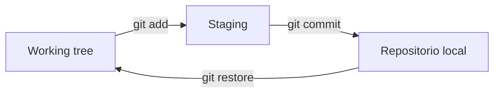
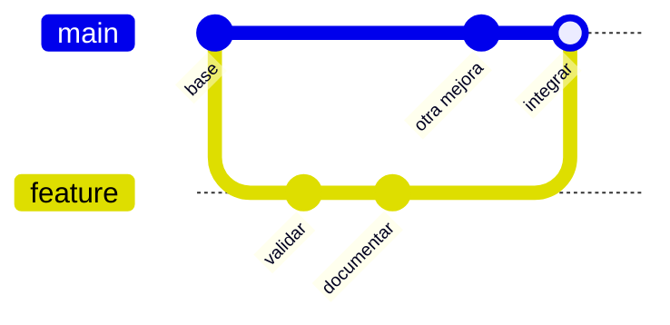

## Pregunta de la sesión

> ¿Qué problema resuelve Git que no resuelve guardar copias o sincronizar una carpeta?

::: notes
Recoger ejemplos reales: final, final2, correo, Drive, carpetas por fecha. No mostrar comandos todavía.
:::

## Objetivos

Al finalizar, podrás:

- explicar la finalidad de Git;
- distinguir Git, GitHub, Drive y backup;
- interpretar working tree, staging y repositorio;
- construir commits coherentes;
- trabajar con ramas sin duplicar carpetas;
- deshacer cambios con operaciones explícitas.

## Ruta de 120 minutos

| Minutos | Trabajo |
|---:|---|
| 0–20 | Problema y diagnóstico |
| 20–45 | Modelo mental de Git |
| 45–70 | Commits e historia |
| 70–90 | Ramas e integración |
| 90–108 | Práctica guiada |
| 108–120 | Evaluación y cierre |

## El problema de `final_ahora_si`

```text
informe.docx
informe_final.docx
informe_final_2.docx
informe_final_corregido.docx
informe_final_ahora_si.docx
```

¿Qué versión produjo la figura publicada?

## Drive conserva archivos

Drive es útil para:

- sincronizar;
- compartir;
- coeditar documentos;
- almacenar binarios;
- recuperar algunas versiones.

Pero no organiza por sí solo una historia científica de cambios relacionados.

## Git conserva decisiones

Un commit puede relacionar:

- cambio del script;
- actualización del metadato;
- corrección del documento;
- evidencia de validación.

La unidad no es el archivo aislado: es un cambio coherente.

## Git, Drive y backup

| Herramienta | Finalidad principal |
|---|---|
| Git | Historia estructurada del proyecto |
| Drive | Sincronización y colaboración en archivos |
| Backup | Recuperación ante pérdida |
| GitHub | Revisión y publicación de repositorios Git |

## Definición operativa

> Git registra instantáneas relacionadas de un proyecto para comparar, recuperar y comunicar cambios.

No es:

- un lenguaje;
- una nube;
- GitHub;
- una copia de seguridad completa.

## Tres espacios



::: notes
Usar tarjetas físicas: mesa de trabajo, bandeja de envío y archivo histórico.
:::

## Estados de un archivo

- untracked;
- modified;
- staged;
- committed;
- ignored.

`git status` responde: ¿qué sabe Git en este momento?

## Primer comando ante la duda

```powershell
git status -sb
```

Después:

```powershell
git diff
git diff --staged
```

Observar antes de modificar el estado.

## Crear o copiar un repositorio

```powershell
# Crear historia en una carpeta existente
git init

# Obtener archivos e historia existentes
git clone URL
```

No son pasos consecutivos para el mismo caso.

## Seleccionar, no arrastrar todo

```powershell
git add book/part-iv/23-git-version-control.qmd
git diff --staged
```

`git add -A` es válido, pero no debe ser la respuesta automática.

## Preparación por fragmentos

```powershell
git add -p
```

Permite separar dos intenciones dentro del mismo archivo.

## Qué es un commit

Un commit contiene:

- instantánea;
- autor y fecha;
- mensaje;
- referencia al estado anterior;
- identificador.

No contiene una garantía de corrección científica.

## Mensajes útiles

Débil:

```text
Update files
```

Revisable:

```text
Validate landing flags before aggregation
```

El mensaje nombra intención, no archivos.

## ¿Cuándo hacer commit?

Cuando existe una unidad que puede:

1. describirse con un verbo;
2. revisarse por separado;
3. validarse;
4. revertirse sin arrastrar cambios ajenos.

## Leer la historia

```powershell
git log --oneline --graph --decorate --all
git show HASH
git diff COMMIT_A..COMMIT_B
```

La historia debe responder por qué, no solo cuándo.

## Ramas: alternativas sin copias

```powershell
git switch main
git switch -c feature/validate-landings
```



## Tres integraciones

1. fast-forward;
2. merge automático;
3. conflicto manual.

Un conflicto es una decisión pendiente, no una avería.

## Conflicto

```text
<<<<<<< main
regla A
=======
regla B
>>>>>>> feature
```

Resolver implica:

- comprender ambas intenciones;
- escribir el resultado;
- validar;
- confirmar la integración.

## Remotos

```powershell
git remote -v
git fetch origin
git pull --ff-only origin main
git push -u origin feature/validate-landings
```

- fetch informa;
- pull descarga e integra;
- push publica commits.

## Qué debe ignorarse

```text
.env
__pycache__/
.Rhistory
.quarto/
data/raw/**
data/external/**
```

`.gitignore` no borra archivos ya versionados.

## Git no es para todo

Evitar en Git normal:

- credenciales;
- datos restringidos;
- bases grandes;
- imágenes o binarios masivos;
- resultados temporales regenerables.

## Deshacer con precisión

```powershell
# Descartar edición de un archivo
git restore ruta/archivo

# Retirar del staging
git restore --staged ruta/archivo

# Revertir un commit compartido
git revert HASH
```

## Comando que no enseñaremos como rutina

```powershell
git checkout -- .
```

Puede eliminar todas las modificaciones no confirmadas del directorio de trabajo.

Primero: `status` y `diff`.

## Actividad guiada · 18 min

En un repositorio de práctica:

1. crear una rama;
2. modificar dos archivos;
3. preparar solo uno;
4. inspeccionar staging;
5. crear un commit;
6. comparar con `main`.

## Decisión crítica · 8 min

Clasifica cada elemento:

- script R;
- CSV institucional de 4 GB;
- README;
- archivo `.env`;
- figura final pequeña;
- caché de Quarto.

¿Git, almacenamiento externo, backup o ignorar?

## Evaluación individual · 7 min

Responde:

1. finalidad de Git en una oración;
2. diferencia entre guardar y hacer commit;
3. función del staging;
4. diferencia entre `fetch` y `pull`;
5. razón para no usar `checkout -- .` de memoria.

## Solución orientativa

- Git conserva historia estructurada y revisable.
- Guardar modifica el archivo; commit registra una instantánea con contexto.
- Staging selecciona el próximo cambio coherente.
- Fetch actualiza referencias; pull además integra.
- Los comandos destructivos requieren inspección previa.

## Criterio de logro

```text
estado observado
→ cambio coherente
→ validación
→ commit interpretable
→ historia recuperable
```

## Cierre

Git no sustituye Drive ni backup.

Convierte la evolución del proyecto en evidencia revisable.