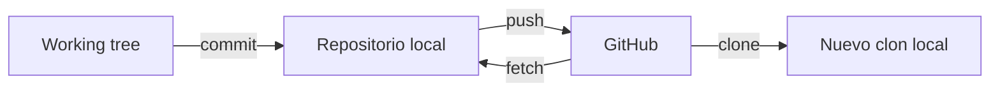
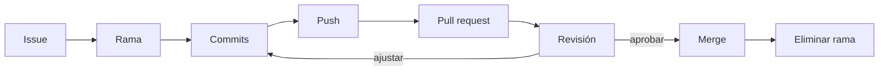
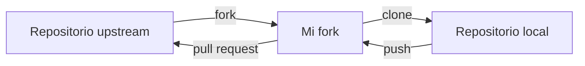

## Pregunta de la sesión

> ¿Qué añade GitHub a un proyecto que ya utiliza Git?

::: notes
Pedir tres respuestas y clasificarlas: almacenamiento, colaboración, publicación, revisión.
:::

## Objetivos

Al finalizar, podrás:

- distinguir Git de GitHub;
- explicar clone, fork y colaboración directa;
- diseñar un GitHub Flow básico;
- redactar un pull request revisable;
- interpretar revisión, checks y merge;
- decidir qué no debe publicarse.

## Ruta de 120 minutos

| Minutos | Trabajo |
|---:|---|
| 0–15 | Propósito y diagnóstico |
| 15–35 | Local, remoto y participación |
| 35–65 | GitHub Flow y pull requests |
| 65–85 | Revisión e integración |
| 85–105 | Actividad aplicada |
| 105–120 | Evaluación y cierre |

## Git funciona sin GitHub

Git puede:

- registrar commits;
- crear ramas;
- comparar;
- fusionar;
- recuperar historia.

Todo localmente.

## GitHub añade una capa colaborativa

- repositorio remoto;
- identidades y permisos;
- issues;
- pull requests;
- revisión;
- checks;
- releases;
- Pages.

## GitHub no es Drive

Drive comparte archivos.

GitHub organiza **propuestas de cambio** vinculadas a:

- commits;
- discusión;
- revisión;
- evidencia;
- decisión de integración.

## Local y remoto



## `origin` no es GitHub

```powershell
git remote -v
```

`origin` es un nombre convencional para una ubicación remota.

Puede apuntar a GitHub, GitLab, un servidor institucional u otro repositorio.

## Tres formas de participar

1. colaborador con escritura;
2. contribuidor mediante fork;
3. edición desde el navegador.

La elección depende de permisos, gobernanza y tipo de cambio.

## Clone frente a fork

| Clone | Fork |
|---|---|
| Operación Git local | Copia alojada bajo otra cuenta |
| Descarga historia | Crea relación entre repositorios |
| No cambia permisos | Permite proponer sin escritura directa |

Después de un fork también suele hacerse clone.

## GitHub Flow



## Empezar por el problema

Issue débil:

```text
Arreglar datos
```

Issue revisable:

```text
Excluir registros invalid del resumen,
conservar el recuento excluido
y mantener intacta la fuente.
```

## Una rama es una propuesta en curso

```powershell
git switch main
git pull --ff-only origin main
git switch -c fix/exclude-invalid-records
```

La rama principal debe conservar un estado aceptable.

## Publicar la rama

```powershell
git push -u origin fix/exclude-invalid-records
```

Push no significa merge.

La rama remota todavía es una propuesta.

## Pull request

Un pull request responde:

1. ¿qué problema resuelve?;
2. ¿qué cambia?;
3. ¿cómo se validó?;
4. ¿qué riesgo queda?;
5. ¿qué debe revisar otra persona?

## Estructura mínima de un PR

```text
Qué cambia
- valida quality_flag;
- informa exclusiones.

Validación
- caso válido;
- caso negativo;
- render de Quarto.

Riesgos
- interpretación de review permanece igual.
```

## Diff antes que opinión

La revisión comienza por:

- archivos cambiados;
- líneas agregadas y eliminadas;
- efecto sobre entradas y salidas;
- pruebas;
- documentación.

No por si «se ve bien».

## Tipos de comentario

- bloqueante;
- sugerencia;
- pregunta;
- observación.

Comentar el cambio, no calificar a la persona.

## Los checks no prueban la ciencia

Un check puede confirmar:

- renderización;
- pruebas;
- formato;
- enlaces;
- ausencia de ciertos errores.

No confirma automáticamente que la interpretación sea válida.

## Estrategias de merge

| Estrategia | Efecto |
|---|---|
| Merge commit | Conserva la rama en la historia |
| Squash | Resume el PR en un commit |
| Rebase | Reproduce commits sobre la base |

El criterio es una historia comprensible y consistente.

## Conflicto durante el PR

Un conflicto indica que la base y la propuesta cambiaron de forma incompatible.

Resolver requiere:

- actualizar la rama;
- comprender ambas intenciones;
- validar el resultado;
- volver a revisar.

## History y Blame

**History:** commits que afectaron al archivo.

**Blame:** último commit por línea.

Blame localiza contexto; no asigna culpa.

## Raw, Edit y Delete

- Raw muestra contenido sin interfaz.
- Edit genera un commit.
- Delete elimina en un nuevo commit.
- La versión anterior permanece en la historia.

## Fork y pull request



## Reglas de la rama principal

Según el riesgo, puede exigirse:

- pull request;
- aprobación;
- checks exitosos;
- conversaciones resueltas;
- rama actualizada.

Gobernanza proporcional, no burocracia automática.

## GitHub Pages

Para este libro:

```text
fuentes .qmd
→ Quarto
→ docs/
→ main
→ GitHub Pages
```

La web publicada debe corresponder a un commit aceptado.

## Releases

Una release identifica un estado comunicable:

- versión de un producto;
- notas de cambios;
- archivos distribuidos;
- referencia citable.

No cada commit necesita una release.

## Qué no debe publicarse

- contraseñas y tokens;
- `.env`;
- datos institucionales;
- información personal;
- conexiones internas;
- binarios grandes sin política;
- contenido sin licencia adecuada.

## Privado no significa sin riesgo

Un repositorio privado sigue necesitando:

- permisos mínimos;
- política de datos;
- revisión de secretos;
- respaldo;
- control de colaboradores.

## Actividad · 20 min

Diseña un cambio para el caso sintético:

1. issue;
2. nombre de rama;
3. dos commits;
4. descripción del PR;
5. validación;
6. comentario bloqueante;
7. estrategia de merge.

## Evaluación individual · 7 min

Responde:

1. diferencia entre Git y GitHub;
2. diferencia entre clone y fork;
3. finalidad de un pull request;
4. límite de los checks;
5. información que nunca publicarías.

## Solución orientativa

- Git registra historia; GitHub organiza colaboración alrededor de esa historia.
- Clone crea un repositorio local; fork crea una copia alojada bajo otra cuenta.
- El PR propone, contextualiza y revisa una integración.
- Los checks verifican condiciones programadas, no verdad científica.
- Credenciales y datos restringidos nunca deben publicarse.

## Criterio de logro

```text
problema
→ rama
→ commits
→ pull request
→ evidencia
→ revisión
→ integración
```

## Cierre

GitHub no mejora un proyecto por estar conectado.

Lo mejora cuando cada cambio tiene contexto, evidencia y una decisión explícita.