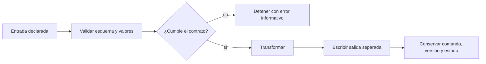

¿Por qué deberíamos confiar en el resultado de un script que termina sin errores? Que el archivo exista o que la cifra parezca razonable no demuestra qué datos entraron, qué supuestos se comprobaron ni qué decisiones transformaron la información. En trabajo científico, el código no es solo una herramienta de cálculo; forma parte de la evidencia.

La respuesta tampoco consiste en convertir cada análisis pequeño en una plataforma compleja. El objetivo es más sobrio: hacer visibles las decisiones importantes y conservar evidencia proporcional al riesgo. Para ilustrarlo usamos un caso enteramente sintético de desembarques pesqueros. La tarea parece sencilla —sumar toneladas por especie—, pero incluye una observación negativa marcada como inválida. Ese detalle permite distinguir entre un script que produce una tabla y uno que aplica un contrato explícito.

## Empezar por el contrato

Antes de reorganizar funciones conviene escribir cinco elementos: entrada, precondiciones, transformación, salida y fallos esperados. En el caso sintético, la entrada es un CSV con columnas definidas; los identificadores deben ser únicos; fechas y cantidades deben tener tipos válidos; la fila marcada como inválida debe excluirse; y la salida debe contener totales por especie sin modificar la fuente.

Este contrato evita refactorizaciones cosméticas. Cambiar nombres o dividir archivos solo tiene valor si reduce un riesgo o hace comprobable una responsabilidad. Un nombre como `records` transporta más intención que `d`; una función `validate_records()` separa una decisión importante de la lectura; un argumento de línea de comandos evita depender de la ubicación personal de quien escribió el programa.

## Fallar bien también es producir evidencia

Los errores silenciosos son especialmente peligrosos porque generan resultados plausibles. Convertir un faltante en cero sin justificación, aceptar una columna ausente o sobrescribir `final.csv` puede no provocar una excepción. Sin embargo, cambia el significado del proceso o destruye su trazabilidad.

Una validación útil ocurre antes de la transformación y comunica qué condición falló. No necesita volcar todo el contenido ni exponer una ruta personal. Debe indicar, por ejemplo, que falta `quality_flag`, que un identificador está duplicado o que una cantidad negativa no fue marcada como inválida. Este fallo temprano acorta la investigación y evita que una entrada defectuosa avance como resultado aparente.

El caso ofrece implementaciones equivalentes en R y Python, además de una consulta SQL de referencia. La equivalencia no significa que los lenguajes deban verse iguales. Significa que comparten el contrato: verifican lo que necesitan, excluyen de forma explícita y producen el mismo tipo de resumen. Compararlas ayuda a separar los principios científicos de la sintaxis particular.

## Evidencia suficiente, no acumulación indiscriminada

Para un proceso pequeño pueden bastar el comando ejecutado, la versión del código, los metadatos de la entrada, la salida y un estado de validación. En un flujo recurrente harán falta registros más estructurados, pruebas automatizadas o un entorno fijado. La escala debe seguir al riesgo, la frecuencia y el costo de un error.

También importa reconocer cuándo detener el refactor. Si el contrato es claro, los fallos relevantes se prueban, la salida no depende de pasos manuales ocultos y otra persona puede repetir el comando, agregar capas puede empeorar la lectura sin aportar garantías. La modularidad es una decisión de diseño, no una competencia por producir más archivos.

## Una pregunta para revisar cualquier script

La revisión más productiva puede expresarse como una cadena:

> riesgo → decisión de diseño → comprobación → evidencia

Si no podemos completar esa cadena, quizá estamos aplicando una preferencia de estilo en lugar de resolver un problema. Si podemos completarla, el cambio es explicable y evaluable. Esa disciplina transforma “funciona en mi computadora” en una afirmación mucho más precisa: conocemos las condiciones de ejecución, hemos comprobado los supuestos relevantes y conservamos lo necesario para repetir o investigar el resultado.

El desarrollo completo, los ejercicios y el caso reproducible están en el capítulo [Principios de código científico](../../../book/part-iv/22-code-principles.qmd). Los archivos ejecutables y los metadatos se conservan en el [repositorio del proyecto](https://github.com/qselmer/QuantFish-LabCore). Este texto permanece como borrador hasta evaluar el aprendizaje y confirmar qué ideas merecen una publicación definitiva.
